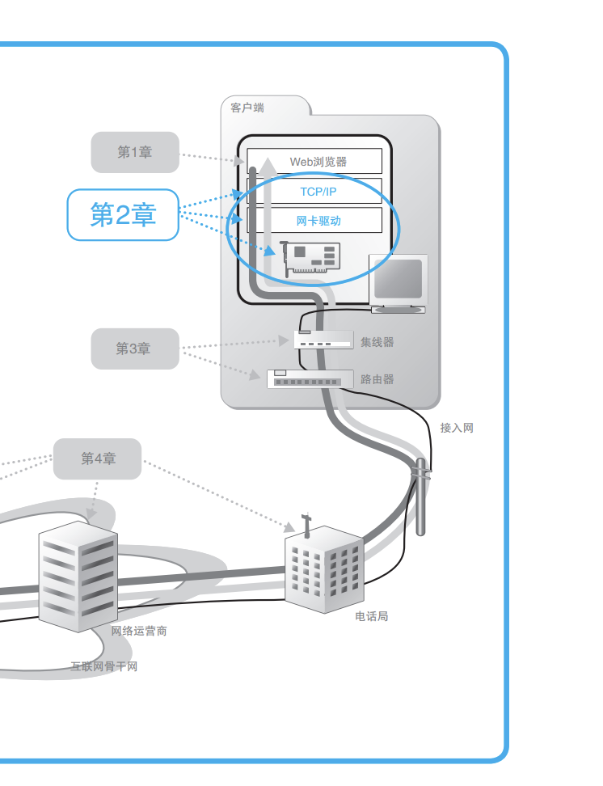


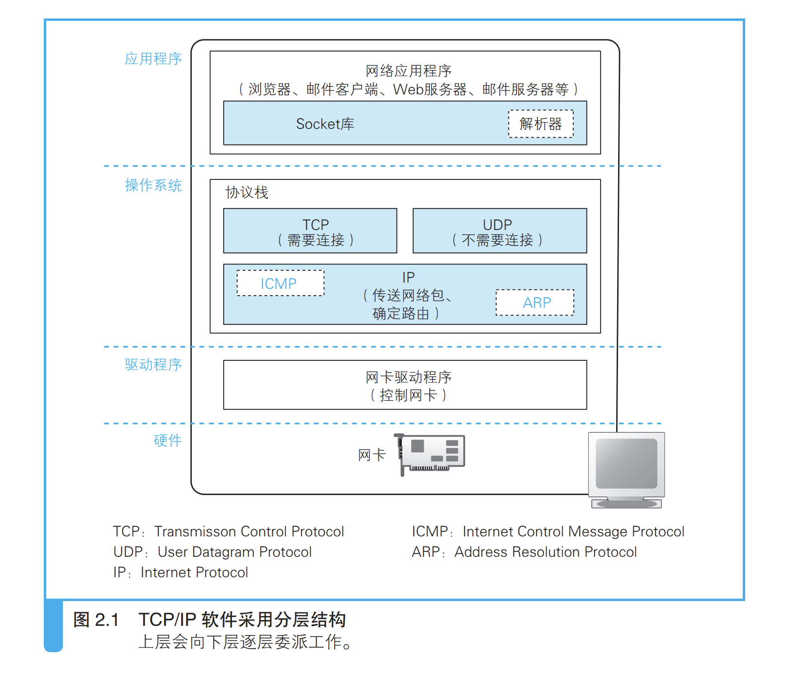

- 图中最上面的部分是网络应用程序，也 就是浏览器、电子邮件客户端、Web 服务器、电子邮件服务器等程序，它 们会将收发数据等工作委派给下层的部分来完成。当然，除了浏览器之外， 其他应用程序在网络上收发数据的操作也都是类似上面这样的
-  应用程序的下面是 Socket 库，其中包括解析器，解析器用来向 DNS 服务器发出查询，
-  再下面就是操作系统内部了，其中包括协议栈。协议栈的上半部分有 两块，分别是负责用 TCP 协议收发数据的部分和负责用 UDP 协议收发数 据的部分，它们会接受应用程序的委托执行收发数据的操作P。   
- 下面一半是用 IP 协议控制网络包收发操作的部分。在互联网上传送数 据时，数据会被切分成一个一个的网络包 A，而将网络包发送给通信对象的操作就是由 IP 来负责的。此外，IP 中还包括 ICMPA 协议和 ARPB 协议。 ICMP 用于告知网络包传送过程中产生的错误以及各种控制消息，ARP 用 于根据 IP 地址查询相应的以太网 MAC 地址 C。
-  IP 下面的网卡驱动程序负责控制网卡硬件，
- 而最下面的网卡则负责完 成实际的收发操作，也就是对网线中的信号执行发送和接收的操作。

### （1）创建套接字 

#### 1. 套接字的实体

 在协议栈内部有一块用于存放控制信息的内存空间，这里记录了用于 控制通信操作的控制信息，例如通信对象的 IP 地址、端口号、通信操作的 进行状态等。本来套接字就只是一个概念而已，并不存在实体，如果一定 要赋予它一个实体，我们可以说这些控制信息就是套接字的实体，或者说 存放控制信息的内存空间就是套接字的实体  

#### 2. 套接字作用

 套接字中记录了用于控制通信操作的各 种控制信息，协议栈则需要根据这些信息判断下一步的行动；例如需要通信的IP地址，端口号，通信时间等

```
 协议栈是根据套接字中记录的控制信息来工作的  
```

#### 3. 套接字例子

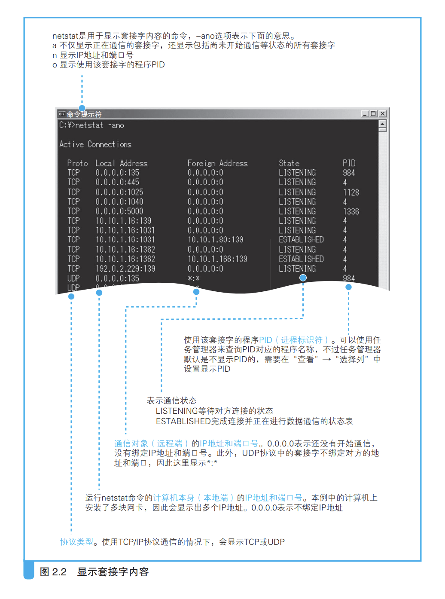

```c
 netstat -ano

活动连接

  协议  本地地址          外部地址        状态           PID
  TCP    0.0.0.0:135            0.0.0.0:0              LISTENING       1548
  TCP    0.0.0.0:2008           0.0.0.0:0              LISTENING       5208
  TCP    0.0.0.0:5040           0.0.0.0:0              LISTENING       8456
  TCP    0.0.0.0:6045           0.0.0.0:0              LISTENING       5208
  TCP    0.0.0.0:7680           0.0.0.0:0              LISTENING       20952
  TCP    0.0.0.0:49675          0.0.0.0:0              LISTENING       1152
  TCP    30.44.114.146:139      0.0.0.0:0              LISTENING       4
  TCP    30.44.114.146:2008     30.54.34.111:35704     CLOSE_WAIT      5208
  TCP    30.44.114.146:6045     30.54.34.111:59626     CLOSE_WAIT      5208
  TCP    [::]:49675             [::]:0                   LISTENING       1152
  TCP    [::1]:49672            [::]:0                 LISTENING       7188
  TCP    [::1]:60214            [::1]:9229             SYN_SENT        17828
  UDP    0.0.0.0:500            *:*                                    5324
  UDP    30.44.114.146:2177     *:*                                    2288
  UDP    30.44.114.146:6112     *:*                                    5208
    
    =====================mac======================
  netstat
Active Internet connections
Proto Recv-Q Send-Q  Local Address          Foreign Address        (state)
tcp4       0      0  localhost.7890         localhost.57066        FIN_WAIT_2
tcp4      23      0  localhost.57066        localhost.7890         CLOSE_WAIT
tcp4       0      0  xsq.lan.57062          114.230.222.138.https  ESTABLISHED
tcp4       0      0  localhost.7890         localhost.57060        FIN_WAIT_2
tcp4      23      0  localhost.57060        localhost.7890         CLOSE_WAIT
tcp4       0      0  localhost.7890         localhost.57059        ESTABLISHED
tcp4       0      0  localhost.57059        localhost.7890         ESTABLISHED
```

### （2）连接服务器

#### 1. 连接什么意思

 连接实际上是通信双方交换控制信息，在套接字中记 录这些必要信息并准备数据收发的一连串操作，  

- 初始化的socket里面有必须的信息，但是协议栈并不知道；需要把服务器的 IP 地址和端口号等信息告知协议栈， 连接服务器 连接操作的目的之一。  
-  客户端向服务器传达开始通信的请求， 也是连接操作的目的之一  

#### 2. 负责保存控制信息的头部

TCP头部信息

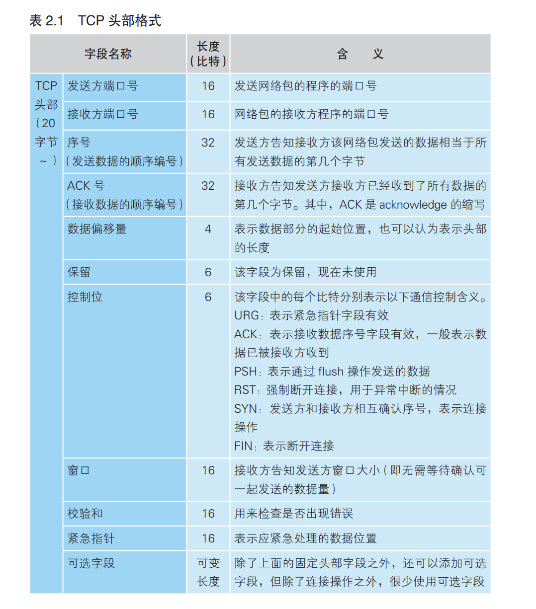

1. `Socketb保存控制信息` 控制信息还有另外一类，那就是保存在套接字中，用来控制协议栈操 作的信息 A。应用程序传递来的信息以及从通信对象接收到的信息都会保存  在这里，还有收发数据操作的执行状态等信息也会保存在这里，协议栈会 根据这些信息来执行每一步的操作。   套接字的控制信息和协议栈的程序本身其实是一体的，因此，“协议栈具体需要哪些信息”会根据 协议栈本身的实现方式不同而不同 ，但这并没有什么问题。因为协议栈中 的控制信息通信对方是看不见的，只要在通信时按照规则将必要的信息写 入头部，客户端和服务器之间的通信就能够得以成立。  
2. TCP头保存控制信息
3. IP头保存控制信息
4. 以太网头部信息

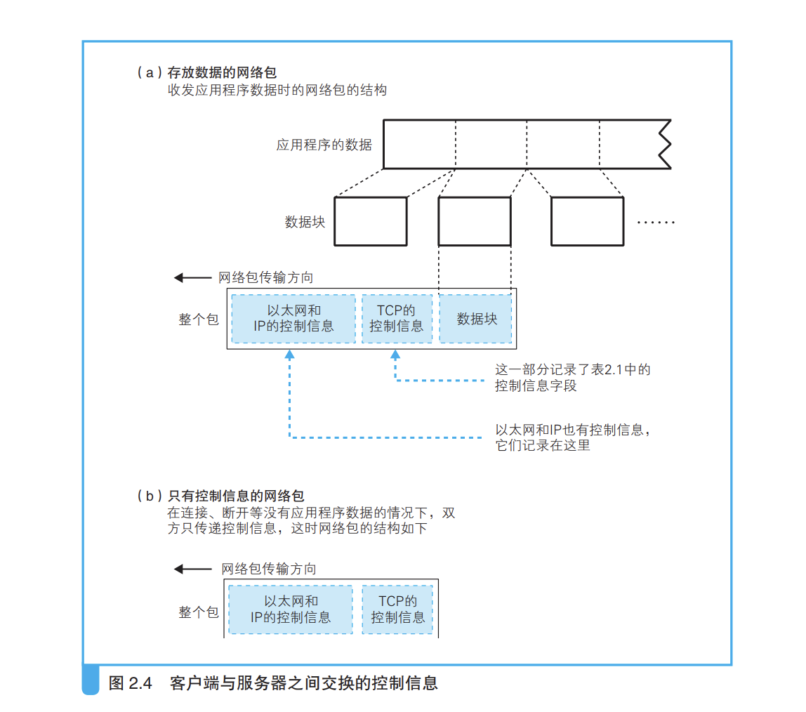

#### 连接操作的实际过程

`连接操作的第一步是在TCP 模块处创建表示连接控制信息的头部。` 

连接其实不是连接，就是更改一下客户端和服务器的控制信息内容，表示二者可以互相通信，这时一个准备过程，但是习惯上称为连接，表示准备完成了而已；

`创建socket` --> `创建TCP信息` -- `创建IP模块信息` -- `创建MAC头部信息` --


### （3）收发数据 

两端的套接字完成连接之后，就进入收发消息的阶段了。在这个阶段， 协议栈会将从应用程序收到的数据切成小块并发送给服务器，考虑到通信 过程中可能会出错导致网络包丢失，协议栈还需要确认切分出的每个包是 否已经送达服务器，对于没有送达的包要重新发送一次。这里我们将对收 发数据的情形加以说明。 

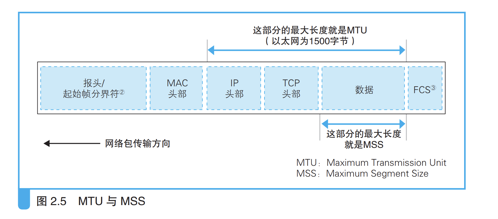

收发数据有两个矛盾的点

1. 不能有数据就发送，次数过多占用带宽，一般先放在缓冲区
2. 缓冲区等待放满发送就会影响响应时间，等待太久

数据包拆分

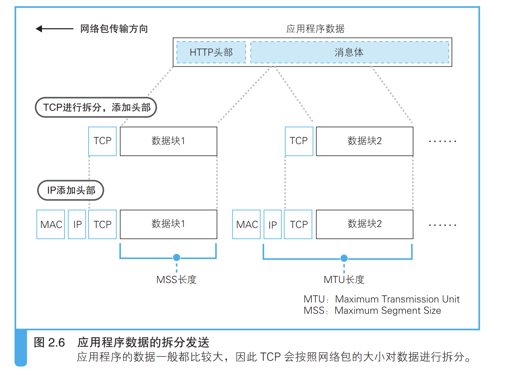

每个数据块添加TCP头部，然后交给IP模块，添加IP头部和MAC头部；

#### 使用ACK号确认网络包收到

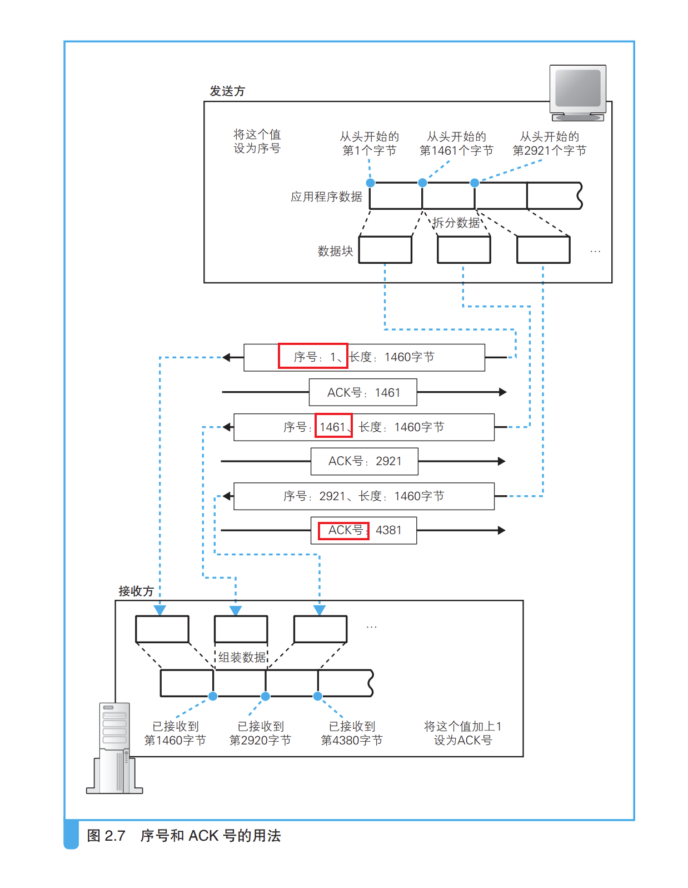

ACK号是客户端用来确认服务器是否接收到自己发送的网络包的，数据是接收数据的长度，同时发送的时候还会带上一个序号数据，告诉服务器自己的数据是总量的哪一部分；序号不是从1开始的，是前面连接建立的时候初始化的一个值，防止数据包被别人解密；

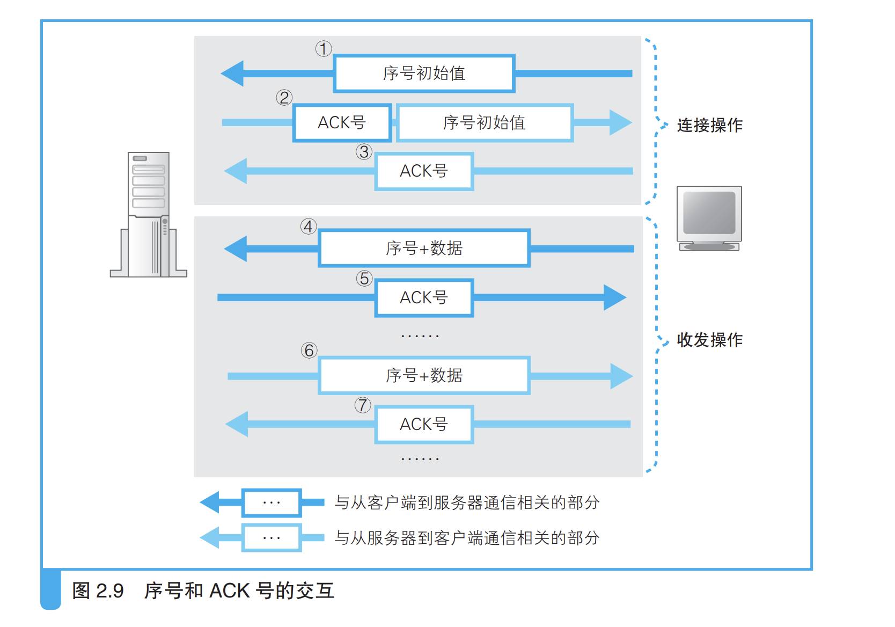

##### 三次握手

建立连接的过程称为三次握手；第一次是客户端发送序号初始值，第二次是服务器回复收到ACK加上序号值，第三次是客户端回复收到ACK；三次握手确认了双方连接是可以互通的，你发给我的信息我可以收到，你发给我的我也可以收到；`满足了双方都发送一次消息给对方，对方都回复了一次确认`

> 因此，网卡、集线器、路由器都没有错误补偿机制，一旦检测到错误 就直接丢弃相应的包。应用程序也是一样，因为采用 TCP 传输，即便发生 一些错误对方最终也能够收到正确的数据，所以应用程序只管自顾自地发 送这些数据就好了

#### 使用窗口管理ACK 号

ACK号是确认收到了消息，方便客户端进行重发包；但是发送一个包等待一个AC K太浪费时间，因此有了窗口管理，就是不等待服务器返回ACK号一直连续发包；

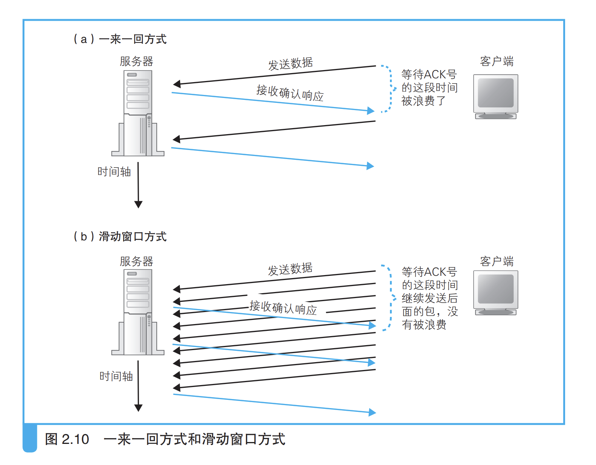

窗口大小指的是服务器或者客户端可以接收数据的最大量，窗口大小会一直变化，因为有数据放入缓冲区，也有数据被处理掉；在等待发送 ACK 号的时候正好需要更新窗口，这时就可以把 ACK 号和窗口更新放在 一个包里发送，从而减少包的数量。当需要连续发送多个 ACK 号时，也 可以减少包的数量，这是因为 ACK 号表示的是已收到的数据量，也就是 说，它是告诉发送方目前已接收的数据的最后位置在哪里，因此当需要连 续发送 ACK 号时，只要发送最后一个 ACK 号就可以了，中间的可以全部省略。

#### 接收HTTP响应消息

>  协议栈尝试从 接收缓冲区中取出数据并传递给应用程序，但这个时候请求消息刚刚发送 出去，响应消息可能还没返回。响应消息的返回还需要等待一段时间，因 此这时接收缓冲区中并没有数据，那么接收数据的操作也就无法继续。这 时，协议栈会将应用程序的委托，也就是从接收缓冲区中取出数据并传递 给应用程序的工作暂时挂起 B，等服务器返回的响应消息到达之后再继续执 行接收操作

### （4）从服务器断开连接并删除套接字

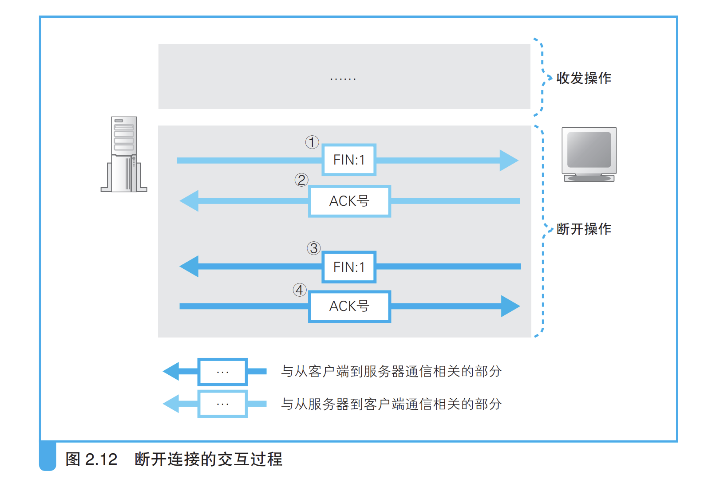

#### 四次挥手

这个断开称为四次挥手，一方发送断开，另一方发送确认，刚好四次；

（1）客户端发送 FIN （2）服务器返回 ACK 号 （3）服务器发送 FIN （4）客户端返回 ACK 号；

套接字在断开后并不会立即删除而是会等会一会，防止意外发生；客户端返回ACK号服务器没有收到就回重新调用3步骤，如果套接字删除就会产生错误；

#### 小结

> 数据收发操作的第一步是创建套接字。一般来说，服务器一方的应用 程序在启动时就会创建好套接字并进入等待连接的状态。客户端则一般是 在用户触发特定动作，需要访问服务器的时候创建套接字。在这个阶段， 还没有开始传输网络包

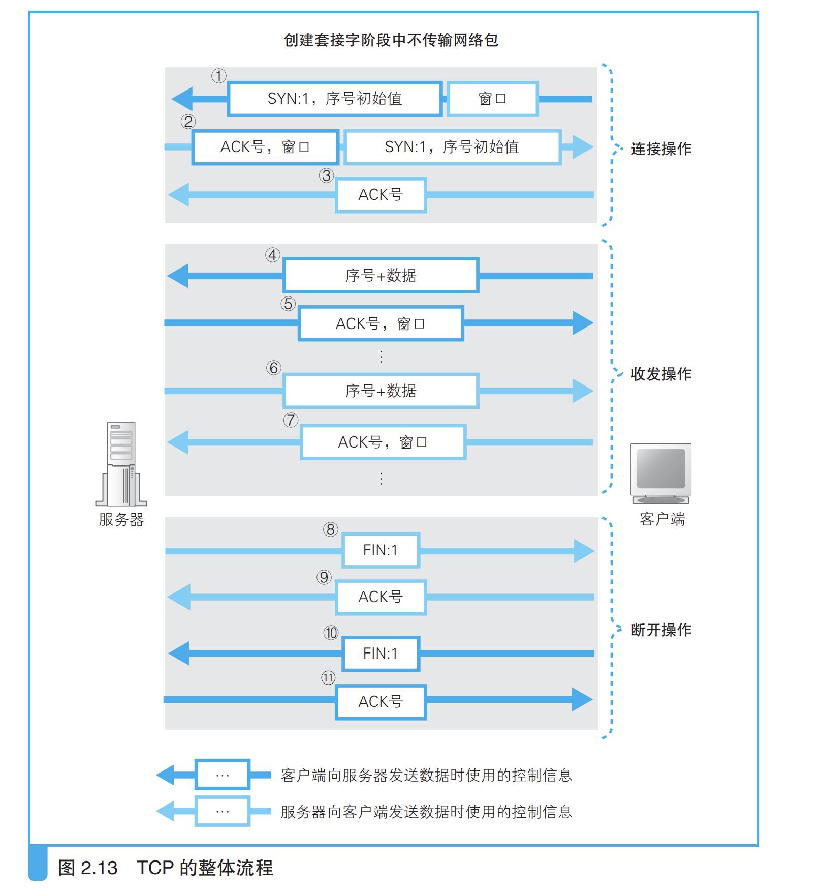

###  （5）IP 与以太网的包收发操作 

在介绍 TCP 协议收发消息的操作之后，我们再来看看实际的网络包是如 何进行收发的。协议栈会与网卡进行配合，将数据切分成小块并封装成网络 包，再将网络包转换成电信号或者光信号发送出去。介绍完这个过程之后， 大家应该就可以对计算机网络功能有一个完整的概念了。 

### （6）用 UDP 协议收发数据的操作 

TCP 协议有很多方便的功能，比如网络包出错丢失时可以重发，因此 很多应用程序都是使用 TCP 协议来收发数据的，但这些方便的功能也有帮 倒忙的时候，在这种情况下我们还有另外一种叫 UDP 的协议。这里我们将 介绍 UDP 的必要性以及它与 TCP 的差异。