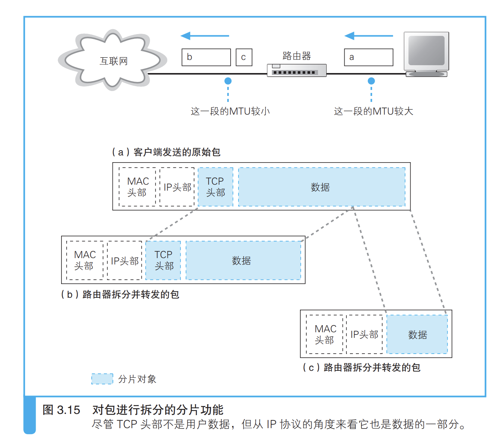

网络的传输过程，从网卡出来之后经过集线器，交换机，路由器。最终到达需要访问的服务器；

现在家庭路由器，一般集成了集线器和交换机的功能；

### （1）信号在网线和集线器中传输

信号从计算机中流出之后，会在网线中经过集线器等设备前进。此时，
信号是如何在网线和集线器传输的，就是我们的第一个看点。信号在传输
过程中会衰减，还会受到噪声干扰而失真，如何抑制这些影响是我们的另
一个看点。

#### 每个包都是独立的

不同于TCP包UDP包，对集线器来说所有的包都是一样的，只是一个数据包而已；

#### 使用双绞线抑制信号干扰，衰减

#### 集线器的作用

当信号到达集线器后，会被广播到整个网络中。以太网的基本架构 A 就 是将包发到所有的设备，然后由设备根据接收方 MAC 地址来判断应该接 收哪些包，而集线器就是这一架构的忠实体现，它就是负责按照以太网的 基本架构将信号广播出去。就是把信号发送出去而已；

### （2）交换机的包转发操作

`交换机的设计是将网络包原样 转发到目的地`

#### 交换机根据地址表进行转发

* 交换机从集线器接收信号，把包存到缓存当中，然后进行转化发送到相应的端口当中
* 端口，每个端口相当于一个网卡，只是不具有MAC地址；

#### MAC地址表维护

* 收到包时，将发送方 MAC 地址以及其输入端口的号码写入 MAC 地址表中。
* 地址表中的记录不能永久有效，而是要在一 段时间不使用后就自动删除（交换机端口连接的机器会移动，而交换机并不知道设备消失，因此采用隔段时间删除操作）

#### 　全双工模式可以同时进行发送和接收

`全双工模式是交换机特有的工作模式，它可以同时进行发送和接收操 作，集线器不具备这样的特性`

> 在以太网中，当没有数据在传输时，网络中会填充一种被称为连接脉 冲的脉冲信号。在没有数据信号时就填充连接脉冲，这使得网络中一直都 有一定的信号流过，从而能够检测对方是否在正常工作，或者说网线有没 有正常连接。以太网设备的网线接口周围有一个绿色的 LED 指示灯，它表 示是否检测到正常的脉冲信号。如果绿灯亮，说明 PHY（MAU）模块以及 网线连接正常 。

### （3）路由器的包转发操作

路由器和交换机一样也负责对包进行转发，但它们的工作方式有一些
差异。交换机是基于以太网规格工作的设备，而路由器是基于 IP 工作的

> 转 发模块负责判断包的转发目的地，端口模块负责包的收发操作。这一分工模 式在第 2 章介绍计算机内部结构的时候也出现过，换句话说，路由器转发模 块和端口模块的关系，就相当于协议栈的 IP 模块和网卡之间的关系。因此， 大家可以将路由器的转发模块想象成 IP 模块，将端口模块想象成网卡。

> 通过更换网卡，计算机不仅可以支持以太网，也可以支持无线局域网， 路由器也是一样。如果路由器的端口模块安装了支持无线局域网的硬件， 就可以支持无线局域网了。此外，计算机的网卡除了以太网和无线局域网 之外很少见到支持其他通信技术的品种，而路由器的端口模块则支持除局 域网之外的多种通信技术，如 ADSL、FTTH，以及各种宽带专线等，只要 端口模块安装了支持这些技术的硬件即可 。

##### 工作原理

> 首先会通过端口将发过来的包接收进来，这一步的工 作过程取决于端口对应的通信技术。对于以太网端口来说，就是按照以太 网规范进行工作，而无线局域网端口则按照无线局域网的规范工作，总之 就是委托端口的硬件将包接收进来。接下来，转发模块会根据接收到的包 的 IP 头部中记录的接收方 IP 地址，在路由表中进行查询，以此判断转发 目标。然后，转发模块将包转移到转发目标对应的端口，端口再按照硬件 的规则将包发送出去，也就是转发模块委托端口模块将包发送出去的意思。

##### 路由器端口

> 端口模 块会根据相应通信技术的规范来执行包收发的操作，这意味着端口模块是 以实际的发送方或者接收方的身份来收发网络包的。以以太网端口为例， 路由器的端口具有 MAC 地址 B，因此它就能够成为以太网的发送方和接收 方 C。端口还具有 IP 地址，从这个意义上来说，它和计算机的网卡是一样 的。当转发包时，首先路由器端口会接收发给自己的以太网包 D，然后查询 转发目标，再由相应的端口作为发送方将以太网包发送出去。这一点和交 换机是不同的，交换机只是将进来的包转发出去而已，它自己并不会成为 发送方或者接收方

#### 路由表中的信息

`路由器根据“IP”地址确定转发目标`

路由器根据bit数来确定转发目标，也就是网段，因此需要子网掩码来屏蔽主机号；

`只匹配网络号，忽略主机号`

> 对路由表进行维护的方法有几种，大体上可分为以下两类。 （a）由人手动维护路由记录 （b） 根据路由协议机制，通过路由器之间的信息交换由路由器自行维 护路由表的记录

>  3.13 路由表中的最后一行的作用 就相当于把所有目标都配置好了。这一行的子网掩码为 0.0.0.0，关键就在 这里，子网掩码 0.0.0.0 的意思是网络包接收方 IP 地址和路由表目标地址 的匹配中需要匹配的比特数为 0，换句话说，就是根本不需要匹配。只要 将子网掩码设置为 0.0.0.0，那么无论任何地址都能匹配到这一条记录，这 样就不会发生不知道要转发到哪里的问题了。
>
> 只要在这一条记录的网关列中填写接入互联网的路由器地址，当匹配 不到其他路由时 A，网络包就会被转发到互联网接入路由器。因此这条记录 被称为默认路由，这一行配置的网关地址被称为默认网关。在计算机的 TCP/IP 设置窗口中也有一个填写默认网关的框，意思是一样的。计算机上 也有一张和路由器一样的路由表，其中默认网关的地址就是我们在设置窗 口中填写的地址

#### 路由器对包进行拆分

#### 路由器和交换机的关系

> 给包加上 MAC 头部并 发送，从本质上说是将 IP 包装进以太网包的数据部分中，委托以太网去传 输这些数据。IP 协议本身没有传输包的功能，因此包的实际传输要委托以 太网来进行。路由器是基于 IP 设计的，而交换机是基于以太网设计的，因 此 IP 与以太网的关系也就是路由器与交换机的关系。换句话说，路由器将 包的传输工作委托给交换机来进行 。
>
> IP 并不 是委托以太网将包传输到最终目的地，而是传输到下一个路由器。在创建 MAC 头部时，也是从 IP 的路由表中查找出下一个路由器的 IP 地址，并通 A　除了使用交换机，还可以使用集线器，或者用交叉双绞线直接连接到路由 器端口都可以。关键是，在委托传输时，只要能按照以太网规则传输包， 不管是什么样的设备都可以。 3.3　路由器的包转发操作 过 ARP 查询出 MAC 地址，然后将 MAC 地址写入 MAC 头部中的，这表 示 IP 对以太网的委托只是将包传输到下一个路由器就行了。当包到达下 一个路由器后，下一个路由器又会重新委托以太网将包传输到再下一个 路由器。随着这一过程反复执行，包就会最终到达 IP 的目的地，也就是 通信的对象
>
> `简单来说，IP （路由器）负责将包发送给通信对象这一整体过程，而其中将包传输到下一 个路由器的过程则是由以太网（交换机）来负责的。`

> 网络并非只有以太网一种，还有无线局域网，以及接入互联网 的通信线路，它们和 IP 之间的关系又是什么样的呢？其实只要将以太网替 换成无线局域网、互联网线路等通信规格就可以了。也就是说，如果和下 一个路由器之间是通过无线局域网连接的，那么就委托无线局域网将包传 输过去；如果是通过互联网线路连接的，那么就委托它将包传输过去。除 了这里列举的例子之外，世界上还有很多其他类型的通信技术，它们之间 的关系也是一样的，都是委托所使用的通信技术将包传输过去。 IP 本身不负责包的传输，而是委托各种通信技术将包传输到下一个路 由器，这样的设计是有重要意义的，即可以根据需要灵活运用各种通信技 术，这也是 IP 的最大特点。正是有了这一特点，我们才能够构建出互联网 这一规模巨大的网络

* 委托传输，自己负责最终目标；

### （4）路由器的附加功能

位于互联网接入端的路由器通常还会提供一些附加功能，例如将私有
地址转换为公有地址的地址转换功能，以及阻止危险网络包的包过滤功
能等。本章最后将介绍一下这些功能，这样我们就会对路由器有较全面
的认识。

#### 通过地址转换有效利用 IP 地址

> 所谓地址，就是用 来识别每一台设备的标志，因此每台设备都应该有一个唯一不重复的地址， 就好像如果很多人的地址都一样，那么快递员就不知道该把包裹送给谁了。 网络也是一样，本来互联网中所有的设备都应该有自己的固定地址，而且最 早也确实是这样做的。比如，公司内网需要接入互联网的时候，应该向地址 管理机构申请 IP 地址，并将它们分配给公司里的每台设备。换句话说，那 个时候没有内网和外网的区别，所有客户端都是直接连接到互联网的
>
> 如果不能保证每台设备有唯一不重复的地址，就会从根本上影响网 络包的传输，这是一个非常严重的问题。如果任由这样发展下去，不久的 将来，一旦固定地址用光，新的设备就无法接入了，互联网也就无法继续 发展了。
>
> 解决地址不足的问题，利用的就是这样的性质，即公司内部设备的地 址不一定要和其他公司不重复。这样一来，公司内部设备就不需要分配固 定地址了，从而大幅节省了 IP 地址。当然，就算是公司内网，也不是可以 随便分配地址的，因此需要设置一定的规则，规定某些地址是用于内网的， 这些地址叫作私有地址，而原来的固定地址则叫作公有地址 A。
>
> 私有地址的规则其实并不复杂，在内网中可用作私有地址的范围仅限 以下这些。 
>
> 10.0.0.0 ～ 10.255.255.255 
>
> 172.16.0.0 ～ 172.31.255.255 
>
> 192.168.0.0 ～ 192.168.255.255
>
> 在制定私有地址规则时，这些地址属于公有地址中还没有分配的范围。 换句话说，私有地址本身并没有什么特别的结构，只不过是将公有地址中 没分配的一部分拿出来规定只能在内网使用它们而已。这个范围中的地址 和其他公司重复也没关系，所以对于这些地址不作统一管理，不需要申请， 任何人都可以自由使用。当然，如果在公司内部地址有重复就无法传输网 络包了，因此必须避免在内网中出现重复的地址。

##### 使用改写端口号的原因

> 但早期的 地址转换机制是只改写地址，不改写端口号的。用这种方法也可以让公司 内网和互联网进行通信，而且这种方法更简单。 但是，使用这种方法的前提是私有地址和公有地址必须一一对应，也 就是说，有多少台设备要上互联网，就需要多少个公有地址。当然，访问 动作结束后可以删除对应表中的记录，这时同一个公有地址可以分配给其 他设备使用，因此只要让公有地址的数量等于同时访问互联网的设备数量 就可以了。
>
> 客户端一方的端口号本来就是从 3.4.3　改写端口号的原因 3.4　路由器的附加功能 空闲端口中随机选择的，因此改写了也不会有问题。端口号是一个 16 比特 的数值，总共可以分配出几万个端口 A，因此如果用公有地址加上端口的组 合对应一个私有地址，一个公有地址就可以对应几万个私有地址，这种方 法提高了公有地址的利用率。

##### 从互联网访问公司内网

#### 路由器的包过滤功能

> 包过滤就 是在对包进行转发时，根据 MAC 头部、IP 头部、TCP 头部的内容 ，按照 事先设置好的规则决定是转发这个包，还是丢弃这个包。我们通常说的防 火墙设备或软件，大多数都是利用这一机制来防止非法入侵的 。

### 小结

1. 集线器具有广播功能，把进入的信息，广播到其余其他端口机器
2. 交换机会把包进行原样转发，仅仅是转发不具有接收功能；
3. 路由器把网络包发送到另一个路由器中
4. 路由器中的包过大会进行分片
5. 路由器根据ip协议设计，交换机根据以太网设计，以太网可以找到另一个设备，根据MAC地址，ip地址可以确定最终的服务器；
6. 路由器和交换机，借用交换机进行包转发的操作；
7. 公司内网通过分配一部分公网根据路由器中的地址转化和端口号可以对应不同的服务器；
