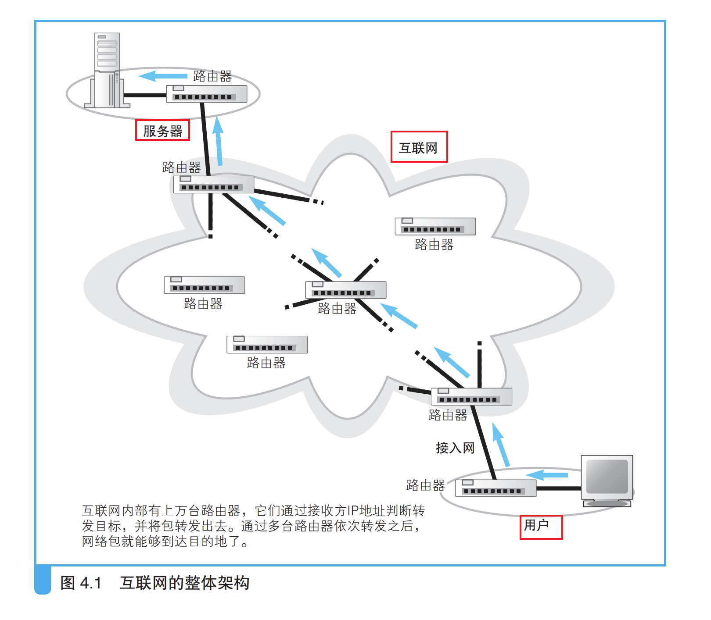
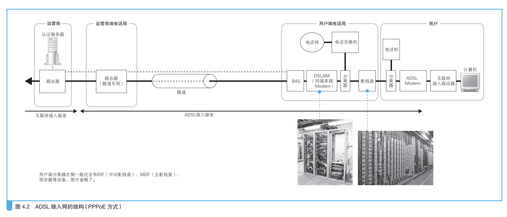

### （1）ADSL 

#### 互联网结构和家庭相同

互联网虽然复杂但是基本 连接方式和家庭相同，都是通过路由器转发实现；距离的不同和路由的维护方式（路由表很大），就是互联网与家庭、公司网络之间最 主要的两个不同点;

路由距离长，路由表很大；

#### 连接用户和互联网的接入网

`在通过互联网接入路由器之后，就进入了互联网`

> 所谓接入网，就是指连接互联网与家庭、公司网络的通信线路 A。一般 家用的接入网方式包括 `ADSL、FTTH、CATV、电话线、ISDN` 等，公司 则还可能使用专线。

### （2）光纤接入网（FTTH）

 我们还会介绍另一种常用的接入网技术——与 ADSL 技术的利用率不 相上下的光纤技术，重点包括光纤结构、单模和多模的区别之类的光纤性 上一章，我们探索了从客户端计算机发送的网络包通 过家庭和公司局域网中的集线器和路由器前往目的地的过 程。本章，我们来看一看网络包是如何通过互联网接入路由器，最终进入 互联网内部的。 189 190 第4章　通过接入网进入互联网内部 质，以及光纤用作接入网时的工作方式。

###  （3）接入网中使用的 PPP 和隧道 

接入网需要通过用户名和密码验证用户的身份，然后由网络运营商向 用户分配公有地址。此外，从接入网向网络运营商传输网络包时还使用了 隧道技术，这些都是本章的看点。 

### （4）网络运营商的内部 

接入网后面连接着网络运营商的网络，运营商网络也是以路由器为核 心组成的，这一点和家庭、公司网络是一样的，包转发的工作原理也没有 区别。不过，运营商网络也使用了一些和家庭、公司网络不同的技术，比 如运营商之间可以自动交换路由信息和更新路由表，这些都是本章的看点。 

（5）跨越运营商的网络包 

互联网是由多个运营商网络相互连接形成的巨大网络，而多个运营商 之间相互连接的部分可以说就是互联网的核心部分，这里也是本章的看点。