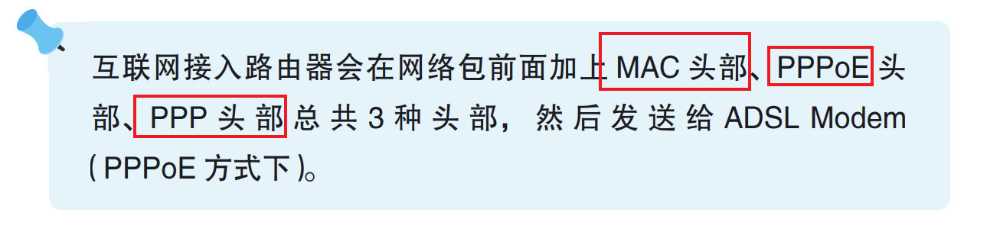
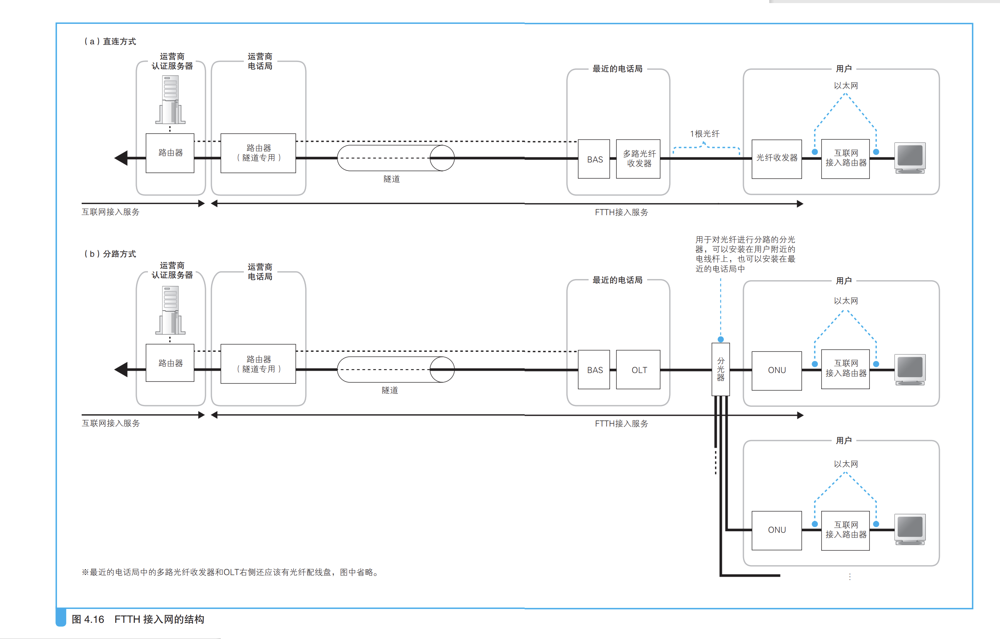
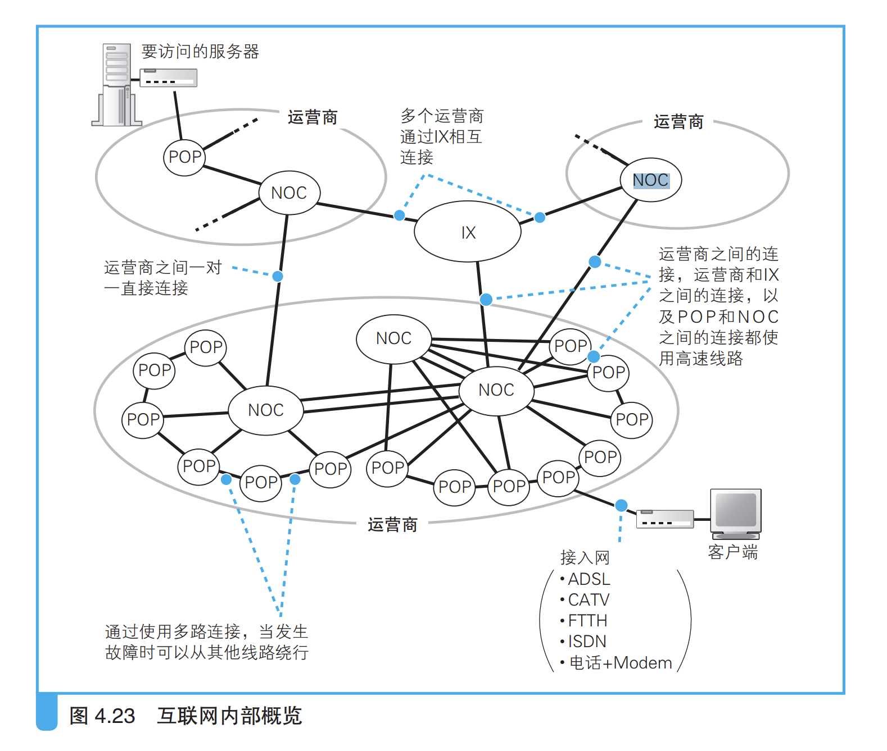

### 名词解释

1. ***ADSL***：Asymmetric Digital Subscriber Line，不对称数字用户线。它是一种 利用架设在电线杆上的金属电话线来进行高速通信的技术，它的上行方向 （用户到互联网）和下行方向（互联网到用户）的通信速率是不对称的。 C 
2. ***FTTH***：Fiber To The Home，光纤到户。指的是将光纤接入家庭的意思。
3. **MODEM** 调制解调器，也叫猫；
4. ***BAS***：Broadband Access Server，宽带接入服务器。它也是一种路由器。
5. ***PPP***：Point-to-Point Protocol，点到点协议。它是电话线、ISDN 等通信线路所 使用的一种协议，集成了用户认证、配置下发、数据压缩、加密等各种功能。
6. **PPPoE**：Point-to-Point Protocol over Ethernet，以太网的点对点协议
7. **DHCP**：Dynamic Host Configuration Protocol，动态主机配置协议。

### （1）ADSL 

#### 互联网结构和家庭相同

互联网虽然复杂但是基本 连接方式和家庭相同，都是通过路由器转发实现；距离的不同和路由的维护方式（路由表很大），就是互联网与家庭、公司网络之间最 主要的两个不同点;

路由距离长，路由表很大；

#### 连接用户和互联网的接入网

`在通过互联网接入路由器之后，就进入了互联网`

> 所谓接入网，就是指连接互联网与家庭、公司网络的通信线路 A。一般 家用的接入网方式包括 `ADSL、FTTH、CATV、电话线、ISDN` 等，公司 则还可能使用专线。

#### 分离器的作用

> 分离器的功能是将一定频率以上的信号 过滤掉，也就是过滤掉了 ADSL 使用的高频信号，这样一来，只有电话信 号才会传入电话机，但对于另一头的 ADSL Modem，则是传输原本的混合 信号给它。ADSL Modem 内部已经具备将 ADSL 频率外的信号过滤掉的功通过接入网进入互联网内部 能，因此不需要在分离器进行过滤 ;

#### 从用户到电话局

> 从分离器出来，就是插电话线的接口，信号从这里出来之后，会通过 室内电话线，然后到达大楼的 IDFA 和 MDFB，外面的电话线在这里和大楼 内部的室内电话线相连接

### （2）光纤接入网（FTTH）

 

###  （3）接入网中使用的 PPP 和隧道 

#### 用户认证和配置下发

> 互联网本来就是由很多台路由器相互连接组成的，因此原则上应该是 将接入网连接到路由器上。随着接入网发展到 ADSL 和 FTTH，接入网连 接的路由器也跟着演进，而这种进化型的路由器就叫作 BAS。
>
> 首先是用户认证和配置下发功能。ADSL 和 FTTH 接入网中，都需要 先输入用户名和密码 C，登录之后才能访问互联网，而 BAS 就是登录操作的 窗口。BAS 使用 PPPoED 方式来实现这个功能 。PPPoE 是由传统电话拨号 上网上使用的 PPP 协议发展而来的

用户向运营商的接入点拨打电话（图 4.17 ① -1），电话接通后（图 4.17 ① -2） 输入用户名和密码进行登录操作（图 4.17 ② -2）。用户名和密码通过 RADIUSF 协议从 RASG 发送到认证服务器，认证服务器校验这些信息是否正确。当确认无误后，  &grave;认证服务器会返回 IP 地址等配置信息，并将这些信息下发给用户 （图 4.17 ② -3&grave;   用户的计算机根据这些信息配置 IP 地址等参数，完成 TCP/ IP 收发网络包的准备工作，接下来就可以发送 TCP/IP 包了（图 4.17 ③）。

> 这个过程的重点在于图 4.17 ② -3 下发 TCP/IP 配置信息的步骤。`在接 入互联网时，必须为计算机分配一个公有地址，但这个地址并不是事先确 定的 `。因为在拨号连接时，可以根据电话号码来改变接入点，而不同的接 入点具有不同的 IP 地址，因此无法事先在计算机上设置这个地址。所以， 在连接时运营商会向计算机下发 TCP/IP 配置信息，其中就包括为计算机分 配的公有地址

#### 通过隧道将网络包发送给运营商

> BAS 除了作为用户认证的窗口之外，还可以使用隧道方式来传输网络 包。所谓隧道，就类似于套接字之间建立的 TCP 连接。在 TCP 连接中， 我们从一侧的出口（套接字）放入数据，数据就会原封不动地从另一个出口 出来，隧道也是如此。也就是说，我们将包含头部在内的整个包从隧道的 一头扔进去，这个包就会原封不动地从隧道的另一头出来，就好像在网络 中挖了一条地道，网络包从这个地道里穿过去一样。 像这样，如果在 BAS 和运营商路由器之间的 ADSL/FTTH 接入服务商 的网络中建立一条隧道，将用户到 BAS 的接入网连接起来，就形成了一条 从用户一直到运营商路由器的通道，网络包通过这条通道，就可以进入互 联网内部了，这样的机制就类似于将接入网一直延伸到运营商路由器。

#### 接入网的整体工作过程

* 互联网接入路由器通过 PPPoE 的发现机制查询 BAS 的 MAC 地址。地址广播方式
* BAS 下发的 TCP/IP 参数会被配置到互联网接入路由器的 BAS 端的端口上，这样路由器就完成接入互联网的准备了。

##### 地址转换

> 互联网接入路由器在转 发包时需要进行地址转换 。刚才我们讲过，BAS 会向用户端下发 TCP/IP的配置信息，`如果将这些信息配置在计算机上，就相当于计算机拥有了公 有地址`，这种情况下不需要进行地址转换也可以访问互联网。其实 TCP/IP 原本的设计就是这样的。然而，`如果使用路由器来上网，BAS 下发的参数 就会被配置在路由器上，而且公有地址也是分配给路由器的。这样一来， 计算机就没有公有地址了`。这时，计算机会被分配一个私有地址，计算机发送的包需要通过路由 器进行地址转换然后再转发到互联网中

### （4）网络运营商的内部 

接入网后面连接着网络运营商的网络，运营商网络也是以路由器为核 心组成的，这一点和家庭、公司网络是一样的，包转发的工作原理也没有 区别。不过，运营商网络也使用了一些和家庭、公司网络不同的技术，比 如运营商之间可以自动交换路由信息和更新路由表，这些都是本章的看点。 

（5）跨越运营商的网络包 

互联网是由多个运营商网络相互连接形成的巨大网络，而多个运营商 之间相互连接的部分可以说就是互联网的核心部分，这里也是本章的看点。
