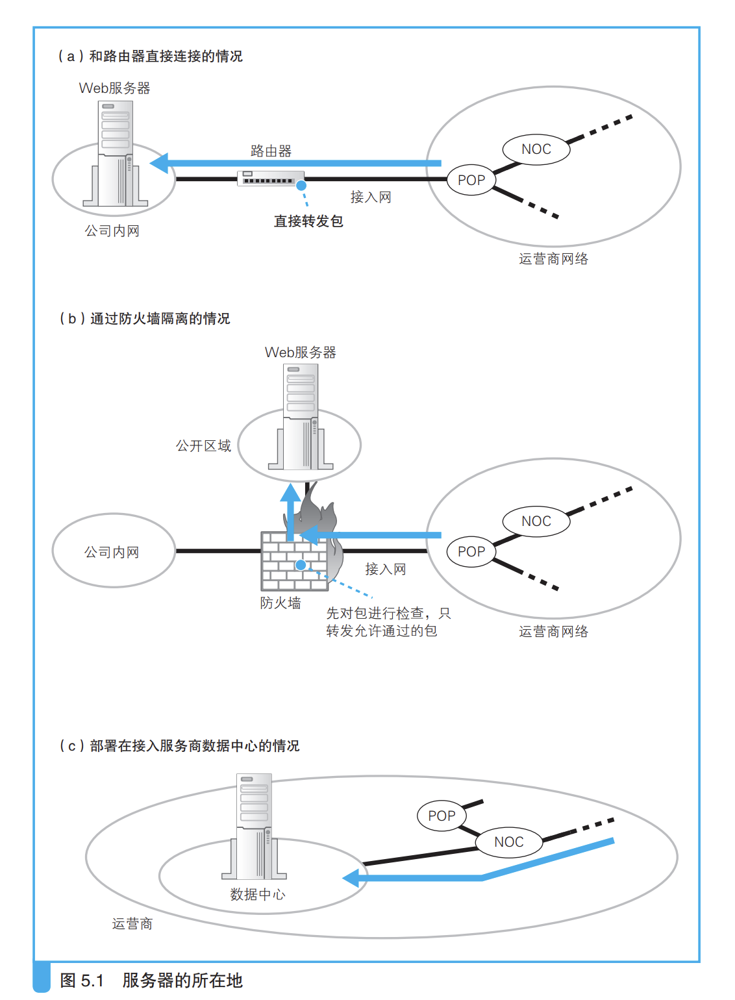
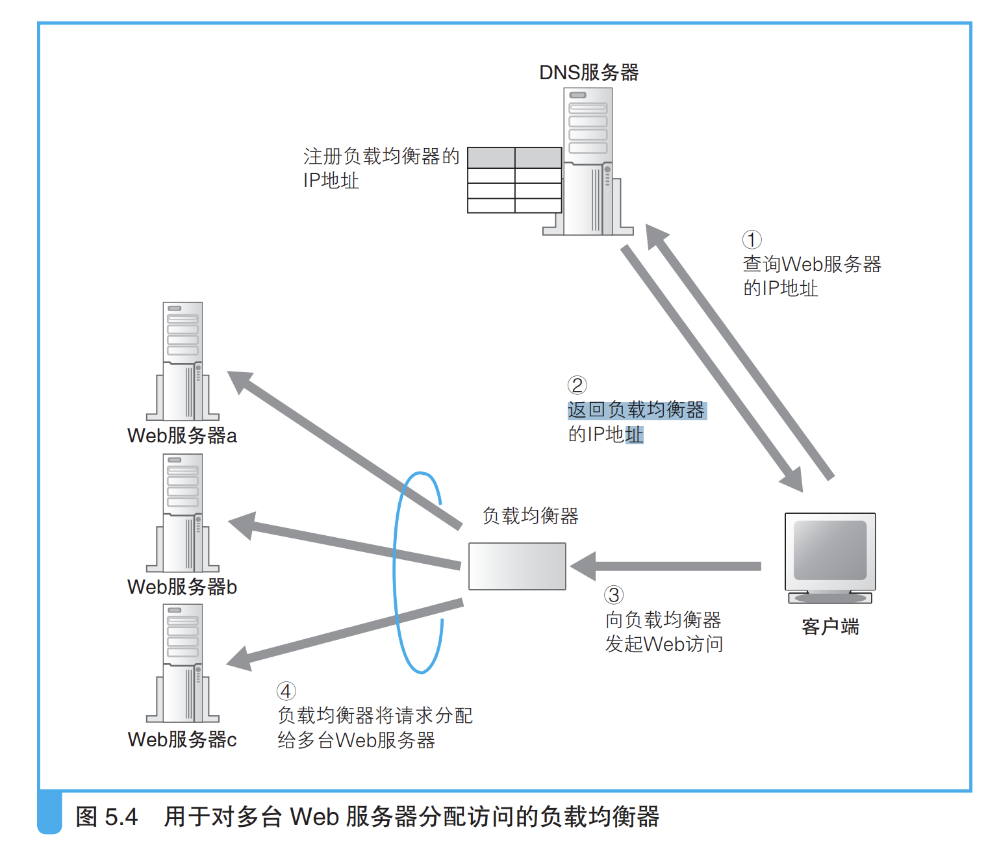
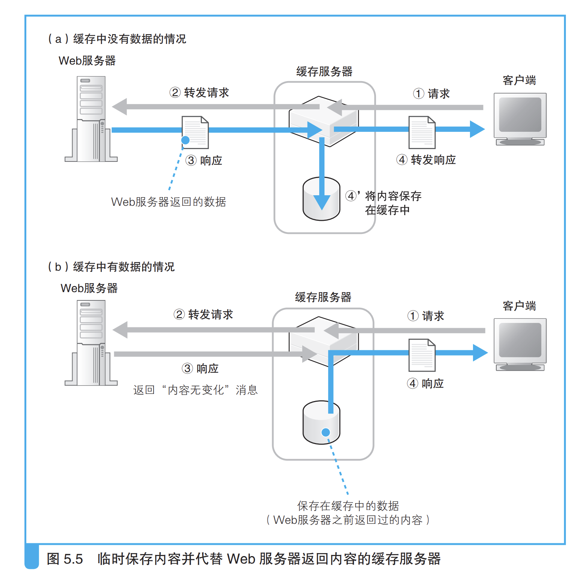
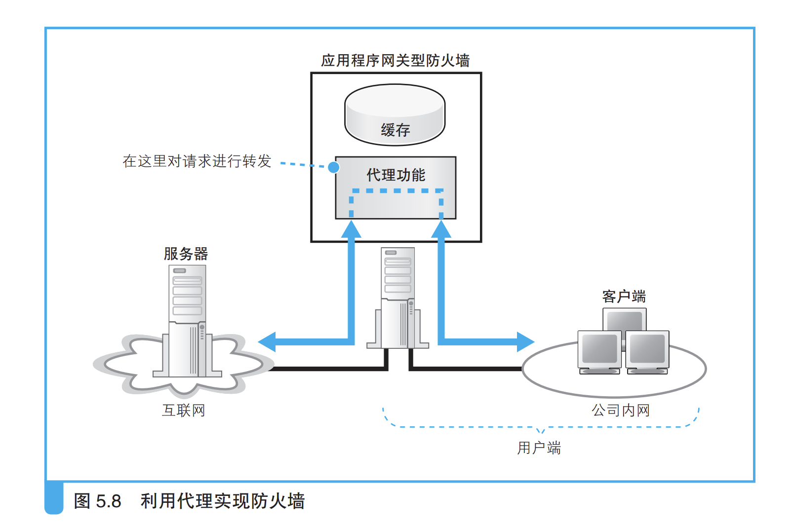

### （1）Web 服务器的部署地点

* 公司里面
* 数据中心；可以直连运营商网络

### （2）防火墙的结构和原理

 `只允许发往特定服务器中的 特定应用程序的包通过，然后屏蔽其他的包`

### （3）通过将请求平均分配给多台服务器来平衡负载 

**用负载均衡器的 IP 地址代替 Web 服务器的实际 地址注册到 DNS 服务器上。**

### （4）利用缓存服务器分担负载 

> 缓存服务器是一台通过代理机制对数据进行缓存的服务器。代理介于 Web 服务器和客户端之间，具有对 Web 服务器访问进行中转的功能。当进 行中转时，它可以将 Web 服务器返回的数据保存在磁盘中，并可以代替 Web 服务器将磁盘中的数据返回给客户端。这种保存的数据称为缓存，缓 存服务器指的也就是这样的功能。 Web 服务器需要执行检查网址和访问权限，以及在页面上填充数据等 内部操作过程，因此将页面数据返回客户端所需的时间较长。相对地，缓 存服务器只要将保存在磁盘上的数据读取出来发送给客户端就可以了，因 此可以比 Web 服务器更快地返回数据。

**如果在指定时间内数据没有变化，就会返回 一个像图 5.7（b）一样的表示没有变化的响应消息（图 5.5（b）③）。这时， Web 服务器只要查询一下数据的最后更新时间就好了**  服务器查询资源的变化情况，根据最后修改时间可以对比所请求的资源是否有变化，如果没有变化就不会返回变化内容，而是告诉缓存服务器数据没有变化，然后返回缓存服务器中的内容；

#### 最原始的代理--正向代理

**缓存服务器使用的代理机制最早就是放在客户端一侧的，这 才是代理的原型，称为正向代理**

**在使用正向代理时，一般需要在浏览器的设置窗口中的“代理服务器” 一栏中填写正向代理的 IP 地址，浏览器发送请求消息的过程也会发生相应 的变化。**

> 正向代理刚刚出现的时候，其目的之一就是缓存，这个目的和服务器 端的缓存服务器相同。不过，当时的正向代理还有另外一个目的，那就是 用来实现防火墙。

> 由于代理在转发过程中可以查看请求的内容，所以可以根据内 容判断是否允许访问。也就是说，通过代理可以禁止员工访问危险的网站， 或者是与工作内容无关的网站。包过滤方式的防火墙只能根据 IP 地址和端 口号进行判断，因此无法实现这一目的。

> 正向代理转发消息的过程也和服务器端的缓存服务器有一些不同，不同点在于对转发目标 Web 服务器的判断上。使用正向代理时，URI 部分为 http://... 这样的完整网址，因此可以根据这个网址来转发，不需要像服务器 端的缓存服务器一样实现设置好转发目标 Web 服务器，而且可以发给任意 Web 服务器。而服务器端的缓存服务器只能向事先设置好的目标进行转 发，这就是两者不同的地方

#### 改良版--反向代理

**不需要在浏览器中设置代 理也可以使用。也就是说，我们可以通过将请求消息中的 URI 中的目录名 与 Web 服务器进行关联，使得代理能够转发一般的不包含完整网址的请求 消息。我们前面介绍的服务器端的缓存服务器采用的正是这种方式，这种使用缓存服务器分担负载 方式称为反向代理（reverse proxy）。**

区别：

* 正向代理是放在客户端的，用来实现防火墙内容检查等功能
* 反向代理是服务器端的，实现负载均衡，DNS加速等功能；

#### 透明代理

### 5）内容分发服务